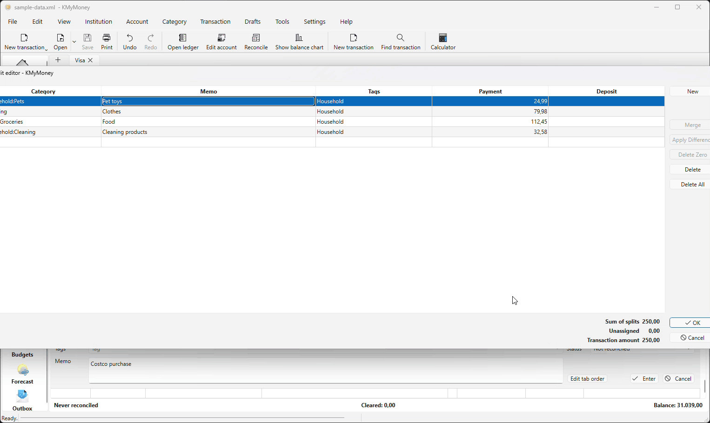

# KMyMoney plugins

A suite of KMyMoney plugins to scratch my itches, built with AI.

|Plugin              | src                                                | description                                                                |
|--------------------|----------------------------------------------------|----------------------------------------------------------------------------|
| Draft transactions | [draft-transactions](./plugins/draft-transactions) | Moves transactions in a **draft** area (so they no longer affect balances), and restores them later. |

## Draft transactions


Shared development configuration for Windows, Linux, and macOS using KDE Craft and **PowerShell 7 Core (`pwsh`)**. The root CMake project supports multiple plugin
targets.

Development plugins install into local staging. FirstRun and CI provision the host through Craft without patching KMyMoney's sources.

The shared `.clang-format` follows the host's KDE C++ formatting rules.

All plugin messages have initial translations for the 46 locales found in the KMyMoney checkouts. See [translation coverage and maintenance](plugins/draft-transactions/po/README.md).
Extract and merge one plugin's catalogs with
`./build.ps1 -Tasks UpdateTranslations -Plugins draft-transactions` after Craft setup.

## Quick start

From the repository root in PowerShell 7, provision KMyMoney and then launch it
with Draft transactions:

```powershell
./build.ps1 -Tasks FirstRun
./build.ps1 -Tasks Stage,Run -Plugins draft-transactions -EnvFile env.ini
```

FirstRun suggests `~/kdecraft-root`, expanded to an absolute path. If Craft is
already installed elsewhere, enter that prefix or set `CRAFT_ROOT` in `env.ini`
before running FirstRun. Leave the source and executable prompts blank to discover
them from Craft. Explicit paths are preserved. Setup installs dependencies and
builds the matching host SDK, so allow time for downloads and compilation.

To choose a host version before setup, add `KMM_APP_VERSION=master` (or another
Craft-supported tag/branch) under `[Environment]` in `env.ini`, or pass
`-KMMAppVersion master` to FirstRun. After successful setup, FirstRun saves the
resolved target even when Craft chose the default.

Close KMyMoney before staging updated plugins. Enable **Draft transactions** in
its plugin settings and use a synthetic test document. For launches without a
rebuild, use `./build.ps1 -Tasks Run -EnvFile env.ini`. To attach a debugger, follow
the [VS Code instructions](#visual-studio-code) below.

## Build tasks

Use PowerShell 7 from the repository root. Start with `FirstRun` to prepare the
PowerShell modules, provision the host SDK, and save your local paths; it does
not require Craft to be configured in the current shell:

```powershell
./build.ps1 -Tasks FirstRun                      # Provision Craft/KMyMoney and save env.ini
./build.ps1                                      # Build all plugins
./build.ps1 -Tasks Build -Plugins draft-transactions
./build.ps1 -Tasks Build, Stage -Plugins draft-transactions
./build.ps1 -Tasks BuildCI -Plugins all           # Build, test, then stage
./build.ps1 -Tasks Clean, Build -Plugins all
# When more plugins exist, pass their directory names as an array:
# ./build.ps1 -Tasks Stage -Plugins draft-transactions, another-plugin
```

`Tasks` and `Plugins` are string arrays. Omitted tasks default to `Build`;
omitted plugins default to `all`. Use `all` alone. Plugin names are directory
names under `plugins/` containing a `CMakeLists.txt`. Unknown names fail before
Craft setup. From another shell, enter `pwsh` first to pass multiple array values.

| Task | Behavior |
| --- | --- |
| `Setup` | Prepare cached PowerShell dependencies without configuring Craft |
| `FirstRun` | Prompt with defaults, provision Craft/KMyMoney and its SDK, then save the resolved paths |
| `Init` | Initialize Craft and configure the native preset for selected plugins, with tests enabled |
| `Clean` | Configure, then run CMake's clean target for the selected build graph |
| `Build` | Configure and compile selected plugins, catalogs, and test executables |
| `Test` | Build, then run CTest; an empty test suite is an error |
| `Stage` | Build, then install selected plugins and catalogs into `stage/<preset>` |
| `BuildCI` | Build, test, and stage; a failure prevents subsequent tasks |
| `Release` | Build and test each selected plugin, then package it for the native platform under `publish/`; requires `-Version` |
| `Configure` / `Install` | Aliases for Init / Stage |
| `Run` | Initialize Craft and start KMyMoney with optional `-KMMAppFile` and `-KMMAppArguments` |
| `EnterCraft` | Keep the Craft environment in the current shell |
| `OpenWorkspace` | Generate a local VS Code workspace and launch it; `-GenerateOnly` skips launch |
| `UpdateTranslations` | Extract and merge catalogs for the selected `-Plugins` |
| `Check` | Initialize Craft, run PowerShell analysis and all module regression tests |
| `PrepareCI` | Provision a Craft host SDK non-interactively, using a disposable prefix |
| `CI` | Provision a Craft host SDK, check, build, test, and stage using native platform presets |

Shared dependencies run once per Invoke-Build invocation. `Stage` does not
implicitly run tests; use `BuildCI` to require passing tests before staging.
`Clean` uses the generated build system and does not delete sources or staged
artifacts. Staging leaves previously installed, unselected plugins in place.
All selections share `build/<preset>` and `stage/<preset>`; do not run concurrent
builds with different selections in one checkout.

All automation enters through `build.ps1`, which loads the
[KMM Plugin Build module](scripts/KMMPluginBuild/KMMPluginBuild.psd1).
`scripts/KMMPluginBuild/Public` contains task operations, `Private` contains
internal helpers, and `Tests` contains the Pester suite. Importing the module
alone performs no setup or environment changes.
Top-level `build.ps1` calls reload the module so updated function signatures are
picked up in persistent PowerShell terminals.

| Parameter | Use |
| --- | --- |
| `-Tasks` | Task names; defaults to `Build` |
| `-Plugins` | Plugin directories or `all`; CI overrides this with `KMM_PLUGINS` |
| `-EnvFile` | INI path relative to the repository, or absolute; defaults to `env.ini` |
| `-ModulePath` | Directory for cached PowerShell dependencies |
| `-Target` | Native CMake target; requires `Build` in `-Tasks` |
| `-Version` | Required `major.minor.patch` package and embedded plugin version for `Release`; independent of the host's `-KMMAppVersion` |
| `-KMMAppVersion` | Craft tag/branch override; otherwise read `KMM_APP_VERSION` |
| `-KMMAppFile` | File opened by `Run`; defaults to `data/sample-data.xml`. Accepts `.kmy`, `.sqlite`, or `.xml`. Relative paths use the repository root; pass `''` to disable the default |
| `-KMMAppArguments` | Literal argument array passed to KMyMoney; requires `Run` |
| `-GenerateOnly` | Write the local workspace without launching VS Code; requires `OpenWorkspace` |
| `-Preview` | Preview EnterCraft, OpenWorkspace, or UpdateTranslations; module setup still runs |

The bootstrap uses `Initialize-KMMPowerShell` inside that module as the single
source of versions for InvokeBuild, Pester, and PSScriptAnalyzer. Missing versions
are saved into ignored `build/powershell/modules`; cached versions are reused.
PSGallery trust and the user's module installation remain unchanged. Populate the
cache before working offline. `-ModulePath` selects another ignored cache, with
relative paths resolved against the repository root.

```powershell
./build.ps1 -Tasks Setup
./build.ps1 -Tasks Setup -ModulePath .cache/powershell
./build.ps1 -Tasks '?'                         # List available tasks
./build.ps1 -Tasks Check -EnvFile laptop.env.ini
./build.ps1 -Tasks OpenWorkspace
./build.ps1 -Tasks UpdateTranslations -Plugins draft-transactions -Preview
```

Normal tasks restore the caller's environment, working directory, and `craft`
function after completion or failure. `EnterCraft` deliberately keeps its
successful environment changes for subsequent commands in the same shell.
Use `pwsh -NoProfile -NoExit -File ./build.ps1 -Tasks EnterCraft` for an interactive
Craft terminal. Neither a child shell nor a task can change its parent IDE's
environment. Craft's own cache and logs persist.

For new plugins, add `plugins/<name>/CMakeLists.txt`. Root CMake discovers these
directories and retains individual `BUILD_<UPPERCASE_NAME>` options (hyphens
become underscores). `build.ps1` enables requested plugins and passes their
names through `KMM_PLUGIN_SELECTION`; direct CMake configuration defaults to
`all`. Every build task applies the current plugin selection explicitly.

Windows BuildCI, staging, and the host engine/XML/SQLite tests have passed locally.
PowerShell checks cover plugin selection, configuration, provisioning orchestration,
native failures, and environment restoration; provisioning tests mock installation.
Earlier Linux Docker validation used the previous distro SDK workflow and does not
validate the current Craft provisioning path. Full Craft CI container runs and
macOS execution remain unverified.

## Craft builds and CI

`-KMMAppVersion` selects a version or branch supported by Craft's KMyMoney
blueprint. It is passed literally to `craft --set version=<value> extragear/kmymoney`
before plugin configuration, on Windows, Linux, and macOS. The parameter overrides
`KMM_APP_VERSION` in the selected INI. An empty value preserves Craft's selection.
See [Craft's version settings](https://community.kde.org/Craft#Hard-code_versions_of_packages).

Set the desired Craft target directly in your ignored `env.ini`:

```ini
[Environment]
KMM_APP_VERSION=master
```

Use the exact version/tag or branch name listed by `craft --search KMyMoney` in
an initialized Craft shell. FirstRun reads this setting and saves Craft's resolved
build target alongside the discovered paths, including when the input was blank
and Craft selected its default. Run `./build.ps1 -Tasks FirstRun` to provision that
version, then `./build.ps1 -Tasks Stage,Run` to build your plugins and launch it.
An explicit `-KMMAppVersion` takes precedence over the INI.

```powershell
./build.ps1 -Tasks BuildCI -KMMAppVersion master -Plugins all
./build.ps1 -Tasks CI -KMMAppVersion master -EnvFile env.ci.ini
```

The version setting persists in Craft. Local Build/BuildCI tasks build plugins
against the installed host SDK; changing the setting alone does not rebuild that
SDK. Provision the matching host with Craft before switching versions locally.
The CI task performs provisioning automatically, so use a disposable Craft prefix.

`CI` runs PrepareCI, Check, and the shared BuildCI task graph. PrepareCI bootstraps
Craft when absent, installs the selected host's dependencies, and builds KMyMoney
from source to retain matching source and generated headers. It queries Craft for
SDK paths and writes the resolved settings to ignored `build/setup/env.ini`.
CRAFT_ROOT defaults to `build/craft` for provisioning. Python, Git, native compiler,
and platform Craft prerequisites must be available on the runner. The same tasks
and native platform presets support Windows, Linux, and macOS.

[.gitlab-ci.yml](.gitlab-ci.yml) currently provisions a Linux x64 Docker runner
using the KMyMoney dependency image. Its shell bootstrap installs system prerequisites
and checksum-verified PowerShell; all subsequent provisioning/build work runs through
`build.ps1 -Tasks CI -EnvFile env.ci.ini`. Windows/macOS runners can use that same
command after supplying their platform prerequisites. Their GitLab jobs remain deferred.

Project settings come from `env.example.ini` and `env.ci.ini`; the latter selects
`master`, headless Qt, and a gettext-compatible locale. Optional runner KMM_PLUGINS
still overrides the INI selection. Network access to KDE, GitHub, PSGallery, and
system package repositories is required. The image runs package installation as root.
Craft's dependencies, downloaded bootstrap, and branch versions can change; this
configuration is not an immutable SDK snapshot.

Linux outputs use `build/craft-linux` and `stage/craft-linux`; other platforms use
their corresponding presets. GitLab retains staged plugins, Pester/CTest JUnit
reports, CMake diagnostics, and the resolved KMyMoney target for 14 days. Craft's
SDK/cache and generated INI are not uploaded. The shared task graph has regression
tests; a complete Craft-provisioned Docker pipeline has not yet been validated.

Merge request/branch/tag rules, SAST, and secret detection remain enabled. Validate
server-provided includes with the target GitLab instance's CI Lint before enabling
merge requirements.

## Release packages

Release builds use the installed **Craft Qt 6 KMyMoney SDK** on every platform.
Windows produces ZIP archives; macOS and Linux produce tar.gz archives. Each
selected plugin gets its own package, manifest and SHA256 checksum. Host and Qt
libraries are not bundled: users need the matching Craft host ABI and runtime.
Distribution DEB/RPM packaging is no longer used. Flatpak packaging remains
unimplemented; it requires a compatible host extension point and runtime build.

```powershell
./build.ps1 -Tasks FirstRun -KMMAppVersion master
./build.ps1 -Tasks Release -Version 0.1.0 -KMMAppVersion master -Plugins draft-transactions
```

`-Version` is the plugin version. `-KMMAppVersion` selects the host target, such as
`master`, `5.2`, or a fixed release supported by Craft. Provision each target with
FirstRun and a matching environment file before Release. Release verifies Craft's
installed package target/revision against the SDK; merely changing a configuration
value does not rebuild or relabel the installed host. Use separate Craft roots and
`-EnvFile` configurations when retaining several host versions.

[`release-compatibility.json`](release-compatibility.json) declares support for each
exact plugin version and is validated against its adjacent JSON schema. A missing
plugin/version entry or unsupported host stops packaging. For example, a policy
can contain:

```json
{
  "kmymoney": ["master", "5.2.*", "5.0 - 5.3"],
  "qtMajor": 6,
  "notes": "Illustrative selectors; declare only combinations verified by builds and tests."
}
```

Named branches match exactly. Numeric globs and inclusive ranges match the resolved
host version, never `master`. `5.0 - 5.3` includes all patches through 5.3;
`5.2.1 - 5.2.4` has exact endpoints. `5.2.1` matches a fixed resolved version;
`5.2` also explicitly permits the Craft 5.2 branch. Compatibility declarations do
not make one binary portable across all those hosts: build separately for each
host target and matching compiler, architecture, Qt and runtime.

The matrix permits Draft transactions **0.1.0 with master and 5.2**. Windows x86_64
builds passed all 47 synthetic CTests against Craft Qt 6 hosts
`5.2.70-2c8ba83af` (master) and `5.2.2-dee8bc541` (5.2). Native macOS/Linux
validation remains outstanding. KMyMoney 5.1 uses Qt 5/KF5 and is incompatible
with this Qt 6/KF6 plugin project.

Artifacts use this layout (architecture is in the filename):

```text
publish/kmymoney/master/windows/draft-transactions-0.1.0-windows-x86_64.zip
publish/kmymoney/5.2/linux/draft-transactions-0.1.0-linux-x86_64.tar.gz
```

The Linux path illustrates the layout; that native platform still needs validation.
Fresh build and staging directories live under `build/<preset>/release/` and
`stage/<preset>/release/`. All selected plugins must pass CTest and packaging
before files are copied to publish. Existing artifacts are never overwritten.
The manifest records the compatibility policy, actual host version, compiler,
Qt version and installed-file checksums. Windows release ZIPs place DLLs and debug
symbols in `bin/kmymoney_plugins`, relative to the KMyMoney installation root
(for example, `C:\Program Files\KMyMoney`). Extract into that root with KMyMoney
closed. Translations go under `bin/data/locale`. For a separate Windows prefix,
add its `bin` to `QT_PLUGIN_PATH` and `bin/data` to `XDG_DATA_DIRS`; see the
packaged INSTALL.txt. Development staging retains its `lib/plugins` layout.

GitLab CI orchestrates native Windows, macOS and Linux workers using
[.gitlab/release.yml](.gitlab/release.yml). Set `KMM_RELEASE_VERSION` to request a
release and `KMM_RELEASE_KMM_VERSION` to the host target (default `master`). Use
`KMM_PLUGINS` to select plugins. Configure these runner variables:

| Platform | Runner tag variable | Runner-local environment file variable |
| --- | --- | --- |
| Windows | `KMM_RELEASE_WINDOWS_RUNNER_TAG` | `KMM_RELEASE_WINDOWS_ENV_FILE` |
| macOS | `KMM_RELEASE_MACOS_RUNNER_TAG` | `KMM_RELEASE_MACOS_ENV_FILE` |
| Linux | `KMM_RELEASE_LINUX_RUNNER_TAG` | `KMM_RELEASE_LINUX_ENV_FILE` |

Every worker runs PrepareCI then Release with the requested host target. Runner
files must point to matching native Craft installations. Launch a separate pipeline
for each host target; the compatibility matrix is a release gate, not a list of
versions to install automatically. A local Release builds only the current platform.

## Local paths and prerequisites

`FirstRun` prompts for `CRAFT_ROOT`, `KMYMONEY_SOURCE_DIR`,
`KMYMONEY_EXECUTABLE`, and `CRAFT_PYTHON`. Press Enter to retain a displayed
value from the existing file. Blank Craft input defaults to the absolute
`kdecraft-root` directory under your user profile (`~/kdecraft-root`). Leave source
and executable blank to discover them from Craft after installation; explicit
paths must be absolute and are preserved. Python is optional: leave it empty on first setup or enter `-`
to select automatic detection. It can otherwise be an executable path or command.
FirstRun bootstraps Craft if necessary, installs KMyMoney dependencies, and builds
the host SDK through Craft. It saves the discovered source, build, and executable
paths only after provisioning succeeds, preserving explicit paths and other settings.
Use `-KMMAppVersion` to select a Craft version or branch. Python, Git, and the native
compiler must already be installed. Provisioning requires network access and may
take substantial time; it modifies the selected Craft installation. A failure
preserves the existing INI, although completed Craft downloads/installations remain.

The default file is `env.ini` at the repository root. Select another file
with `-EnvFile`; relative filenames resolve against the repository root:

```powershell
./build.ps1 -Tasks FirstRun -EnvFile laptop.env.ini
./build.ps1 -Tasks BuildCI -Plugins all -EnvFile laptop.env.ini
./build.ps1 -Tasks FirstRun, Build -EnvFile another.env.ini
./build.ps1 -Tasks EnterCraft -EnvFile laptop.env.ini
./build.ps1 -Tasks Stage -EnvFile laptop.env.ini
./build.ps1 -Tasks OpenWorkspace -EnvFile laptop.env.ini
./build.ps1 -Tasks UpdateTranslations -Plugins draft-transactions -EnvFile laptop.env.ini
```

Use names ending in `.env.ini` for local variants; these and `env.ini` are
git-ignored. The file uses literal `KEY=value` entries, optionally under
`[Environment]`. Spaces, backslashes, `#`, `;`, and `=` inside values are retained.
Single or double quotes around a value are accepted; PowerShell expressions,
`$env:...`, and `~` are not expanded. Comments occupy their own lines starting
with `#` or `;`. Unknown or duplicate keys are rejected.

All configurable project variables are listed in [env.example.ini](env.example.ini).
The selected INI overrides those shared defaults and supplies the task environment;
omitted keys use the example's defaults. FirstRun writes every key, prompting for
the four local paths and preserving other settings. Empty `CRAFT_PYTHON` selects
automatic detection. A missing explicitly selected file is an error except when
creating it with FirstRun. `build.ps1` restores the caller's environment
after normal tasks finish. The `EnterCraft` task intentionally keeps the initialized
environment for IDEs and subsequent commands.

Install PowerShell 7, usable Python (at least 3.9), Git, and the native compiler/debugger
before FirstRun. FirstRun can bootstrap Craft; the resulting development environment
also needs CMake 3.21+, Ninja, and GNU gettext. Match the host's
compiler ABI, architecture, Qt major version, and runtime libraries.

| Platform | Preset | Toolchain / VS Code debugger |
| --- | --- | --- |
| Windows | `craft-windows` | MSVC 2022 x64 / Microsoft C++ debugger |
| Linux | `craft-linux` | Craft-compatible native compiler / GDB |
| macOS | `craft-macos` | AppleClang / CodeLLDB |

The presets build natively, not across operating systems. Linux uses CMake's
native compiler discovery; set `CC` and `CXX` before the first configuration
if Craft requires a particular compiler. On macOS the host and dependencies
must match the native architecture; use a personal preset for a different
architecture or deployment target. Windows requires the MSVC C++ tools and
Windows SDK matching Craft's configuration.

Supply local paths through FirstRun and edit SDK overrides in `env.ini`.
No machine-specific paths are stored in shared configuration.

| Variable | Meaning |
| --- | --- |
| `CRAFT_ROOT` | Required: absolute Craft installation prefix, containing `craft/` and `etc/` |
| `KMYMONEY_SOURCE_DIR` | Required: absolute path to the existing host source checkout |
| `KMYMONEY_EXECUTABLE` | Required: absolute path to the host executable; on macOS use the binary inside its app bundle |
| `CRAFT_PYTHON` | Optional: Python executable path or command; otherwise probe Craft's `bin/python3` and `bin/python`, then `python3` and `python` on PATH (with `.exe` on Windows) |
| `KMM_APP_VERSION` | Craft tag/branch; FirstRun saves the resolved target after provisioning |
| `KMM_PLUGINS` | Comma-separated plugin selection for CI; defaults to `all` |
| `KMYMONEY_BUILD_DIR` | Optional: matching host build tree containing generated headers; defaults to Craft's `build/extragear/kmymoney/work/build` when present |
| `KMYMONEY_SDK_SOURCE_DIR` | Optional: source used for the installed host; discovered from its build cache, falling back to `KMYMONEY_SOURCE_DIR` |
| `CMAKE_BUILD_PARALLEL_LEVEL` | CMake build concurrency; shared default is `4` |
| `QT_QPA_PLATFORM` | Leave empty for interactive desktop testing; CI uses `offscreen` |
| `LANG`, `LC_ALL` | Optional locale settings; Linux CI sets `en_US.UTF-8` |

For example, set these literal values in your ignored `env.ini` on Windows:

```ini
[Environment]
CRAFT_ROOT=C:/Programe/kdecraft-root
KMYMONEY_SOURCE_DIR=C:/Proiecte/OSS/KMyMoney/kmymoney
KMYMONEY_EXECUTABLE=C:/Programe/kdecraft-root/bin/kmymoney.exe
CRAFT_PYTHON=C:/Programe/kdecraft-root/bin/python.exe
```

On Linux or macOS, supply absolute native paths. For macOS, point the executable
at the binary inside the KMyMoney app bundle. Values do not expand `$HOME` or `~`.

`Plugins` defaults to `all`. When CI, TF_BUILD, or GITHUB_ACTIONS identifies a CI
build, initialization replaces it with KMM_PLUGINS, including an explicit
`-Plugins` argument. A runner's KMM_PLUGINS overrides the INI selection. Other
settings come from the INI; use `-KMMAppVersion` for a one-off Craft version or branch.
GitLab selects `env.ci.ini` for headless Qt and locale overrides. Runner flags,
Craft's generated environment, and calculated preset/staging paths are runtime
state rather than user configuration.

From this repository, initialize the current shell:

```powershell
./build.ps1 -Tasks EnterCraft
Get-Command craft, cmake, ninja
cmake --list-presets
```

The script invokes Craft's `CraftSetupHelper.py --setup --format=json`, the
same environment generator used by Craft's shell wrappers, and imports its
environment directly into PowerShell. No Bash or Windows PowerShell wrapper is
required. It preserves the working directory and exports `KMYMONEY_PRESET`
and `KMYMONEY_STAGE_DIR` for the current platform. It adds the staged plugin,
data, and library directories using native path separators. Repeated setup
deduplicates these paths. Craft may update its own environment cache/logs.
Failed initialization restores the process environment; it cannot undo Craft's
cache or log writes. An explicit `CRAFT_PYTHON` must work: it is never silently
replaced with another interpreter.

A `craft` function is available in the initialized shell. To provision host
dependencies, run `craft --install-deps kmymoney`; `craft kmymoney` builds or
installs the host selected by the blueprint. These commands change the shared
Craft installation. Craft does not automatically build `KMYMONEY_SOURCE_DIR`;
verify that the installed host and reference checkout match.

See [KDE Craft](https://community.kde.org/Craft) and its
[environment helper source](https://invent.kde.org/packaging/craft/-/blob/master/bin/CraftSetupHelper.py).

## PowerShell automation

See the [module and task reference](scripts/README.md) for parameters, side
effects, error handling, and regression checks. Use `Get-Help ./build.ps1 -Full`
or `./build.ps1 -Tasks '?'` to inspect the entry point.

```powershell
pwsh -NoProfile -File ./build.ps1 -Tasks OpenWorkspace
pwsh -NoProfile -File ./build.ps1 -Tasks Configure
pwsh -NoProfile -File ./build.ps1 -Tasks Build
pwsh -NoProfile -File ./build.ps1 -Tasks Stage
pwsh -NoProfile -File ./build.ps1 -Tasks Run
```

Build configures first; Stage builds and installs the selected plugins. Run
starts the host without rebuilding. Use `-Plugins draft-transactions` to select
that plugin, or `-Tasks Build -Target drafttransactions` for a specific CMake target.
Run opens `data/sample-data.xml` by default. Override the document as follows
(also works with `-Tasks Stage,Run`):

```powershell
./build.ps1 -Tasks Run -KMMAppFile 'data/sample.kmy'
./build.ps1 -Tasks Run -KMMAppFile 'data/sample.sqlite'
./build.ps1 -Tasks Run -KMMAppFile 'data/sample.xml'
```

The file must exist. Relative paths use the repository root; quote paths containing
spaces. SQLite files use KMyMoney's SQL storage URL and require its SQL storage
plugin. `.xml` means a KMyMoney XML document. Additional host options can be combined
with `-KMMAppFile`.

Pass host arguments from PowerShell as an array:
`./build.ps1 -Tasks Run -KMMAppArguments @('--help')`.

Files can also be supplied as positional host arguments:

```powershell
./build.ps1 -Tasks Run -KMMAppFile '' -KMMAppArguments @('data/sample.kmy')
./build.ps1 -Tasks Run -KMMAppFile '' -KMMAppArguments @('data/sample.xml')
./build.ps1 -Tasks Run -KMMAppFile '' -KMMAppArguments @('sql://localhost/C:/data/sample.sqlite?driver=QSQLITE&mode=single')
```

`KMMAppArguments` forwards values unchanged, with the repository root as the host's
working directory. For SQLite, supply a SQL URL (the example above is for Windows),
including URL encoding for special characters in the path. `KMMAppFile` performs
that conversion and checks that the file exists. Supply the document through one
parameter only: KMyMoney opens the first positional file argument. Use
`-KMMAppFile ''` to suppress the sample when supplying a file through
`KMMAppArguments`, or to launch without an explicit file.

`-Preview` is supported for EnterCraft, OpenWorkspace, and UpdateTranslations.
It previews those operations; dependency module setup still runs before tasks.
Native errors stop the task graph and produce a nonzero process exit status.
The root entry point returns normally on success so interactive shells stay open.

Build output lives in `build/<preset>`; installs go to `stage/<preset>`.
All presets use Ninja and `RelWithDebInfo`, with Craft from `$env{CRAFT_ROOT}`.
The KDE install settings keep plugins under `lib/plugins` in the local prefix.
Do not install development plugins into the shared Craft installation.
Personal overrides belong in ignored `CMakeUserPresets.json`; the automation
selects the three shared native presets, so invoke custom presets explicitly.

For IDE CMake integration, the equivalent commands after initializing Craft are:

```powershell
cmake --preset $env:KMYMONEY_PRESET
cmake --build --preset $env:KMYMONEY_PRESET
cmake --install "build/$env:KMYMONEY_PRESET"
ctest --test-dir "build/$env:KMYMONEY_PRESET" --output-on-failure
```

## Plugin integration and loading

The standalone build uses Qt 6, KDE Frameworks 6, LibAlkimia6, installed KMyMoney
libraries, and matching source/generated headers through `cmake/FindKMyMoneyHost.cmake`.
KMyMoney does not provide a complete exported SDK: some headers are omitted from
its install rules. Keep the matching Craft source and build tree available.
The module checks key installed headers against the SDK source and rejects mismatches.
Your workspace reference checkout can differ from the SDK source; use the latter
for host breakpoints. Plugin build tasks do not rebuild the host; FirstRun and
PrepareCI build its SDK through Craft.

Install rules honor the staging prefix. The plugin namespace
is `kmymoney_plugins`: modules belong in
`stage/<preset>/lib/plugins/kmymoney_plugins`, with required data under `share`.
The environment also searches `stage/<preset>/plugins` for alternative layouts.
Keep Windows PDBs, Linux debug information, or macOS dSYM bundles available.
On Windows, `Stage` (including `Install` and `BuildCI`) also copies Craft's
`bin/libsqlcipher.dll` to `stage/craft-windows/bin/sqlite3.dll` when Craft lacks
`bin/sqlite3.dll`. This works around a SQLCipher package whose import library
still requests the original DLL name. Craft itself remains unchanged. Identical
staged copies are reused; if a different copy exists after a Craft upgrade,
Stage stops: move that staged file aside and rerun Stage. The initialized IDE
environment includes the staging `bin` directory on PATH. Linux and macOS skip
this workaround.

Use the same host/plugin ABI and release runtime; changing only the plugin to
Debug can break compatibility with the installed release Qt libraries.

On Linux, the setup adds staged/Craft `lib` directories to `LD_LIBRARY_PATH`;
on macOS it uses `DYLD_LIBRARY_PATH`. Targets must still have correct
RPATH/install names. macOS protected or hardened applications can restrict
loader environment variables or third-party modules; use a compatible local
development host. Start the actual app executable through PowerShell so the
environment is inherited.

Close the host before installing an updated module, then restart it. Enable the
plugin in KMyMoney settings if applicable and exercise its entry point. Use
synthetic financial data: these launch configurations use normal user settings.

## Visual Studio Code

Debug the KMyMoney executable configured in `env.ini`; it loads the staged
**Draft transactions** plugin. Keep `RelWithDebInfo` for debugging symbols and
compatibility with the host's release runtime.

1. **Close KMyMoney and all VS Code instances.** From PowerShell 7 at the
   repository root, build and stage the plugin, then launch the workspace:

   ```powershell
   ./build.ps1 -Tasks Stage -Plugins draft-transactions -EnvFile env.ini
   ./build.ps1 -Tasks OpenWorkspace -EnvFile env.ini
   ```

   `OpenWorkspace` initializes Craft and starts VS Code with the configured host
   and staged plugin search paths. An already-running editor can retain its old
   environment.

2. **Prepare the editor.** Install the recommended C/C++, CMake Tools, PowerShell,
   and EditorConfig extensions; macOS debugging also requires CodeLLDB. Select
   PowerShell 7 in the PowerShell extension's session menu. Select **Plugins** as
   the active CMake folder and enable your native preset: `craft-windows`,
   `craft-linux`, or `craft-macos`.

3. **Select the debugger.** Open **Run and Debug** and choose:

   | Platform | Configuration | Debugger |
   | --- | --- | --- |
   | Windows | `KMyMoney / Windows (MSVC)` | Microsoft C/C++ (`cppvsdbg`) |
   | Linux | `KMyMoney / Linux (GDB)` | Microsoft C/C++ (`cppdbg`), GDB on PATH |
   | macOS | `KMyMoney / macOS (LLDB)` | CodeLLDB (`lldb`) |

   These configurations already launch `KMYMONEY_EXECUTABLE` with the staged
   plugin search paths and `QT_DEBUG_PLUGINS=1` for loader diagnostics.

4. **Set breakpoints and press F5.** Set breakpoints in
   `plugins/draft-transactions/src`. Enable **Draft transactions** in KMyMoney's
   plugin settings if necessary. Open synthetic test data and exercise
   **Move to drafts**, **Drafts > Show drafts…**, and **Restore**.

5. **Restage after code changes.** Stop debugging and close KMyMoney, then run
   the Stage command from step 1 again in the repository's PowerShell terminal.
   Press F5 to debug the updated plugin. The launch configurations do not build
   or stage automatically. **KMyMoney: run** starts the host without a debugger.

Breakpoints may remain unresolved until KMyMoney loads the plugin. If they stay
unresolved, inspect the loader output for the staged module and dependency errors.
`RelWithDebInfo` uses optimization, so stepping and inspected variables can be
affected. These sessions use your normal KMyMoney settings.

There is one shared workspace template, `kmymoney-plugin.code-workspace`.
`OpenWorkspace` resolves environment-based folder paths into the ignored
`kmymoney-plugin.local.code-workspace`, containing **Plugins**, **KMyMoney**, and
**Craft**. Edit the shared template and rerun the launcher after changes;
`-GenerateOnly` regenerates without starting the editor. Opening the shared file
directly gives a repository-only workspace.
See [VS Code variable substitution](https://code.visualstudio.com/docs/reference/variables-reference).

Workspace tasks include **Plugins: configure**, **Plugins: build**, and
**Plugins: install** (Stage). These tasks use the default `env.ini` and default
plugin selection (`all`). To stage only Draft transactions, use the explicit
command above. Terminal profiles use `pwsh` and initialize Craft; automatic
CMake configuration is disabled.

If you use another `-EnvFile`, pass it explicitly to subsequent build commands;
the launcher does not rewrite workspace task arguments. Restart VS Code through
`OpenWorkspace` after changing environment paths. A task or terminal cannot
update the environment of its parent IDE.

## CLion

Debug the KMyMoney executable configured in `env.ini`, with the staged
**Draft transactions** plugin loaded into it. Use a custom build target to stage
your changes before each debugging session.

1. **Close CLion and KMyMoney.** From PowerShell 7 at the repository root:

   ```powershell
   ./build.ps1 -Tasks Stage -Plugins draft-transactions -EnvFile env.ini
   ./build.ps1 -Tasks EnterCraft -EnvFile env.ini

   # Print the executable path to use in CLion:
   $env:KMYMONEY_EXECUTABLE

   # Start CLion from this same shell, if its launcher is on PATH:
   clion .
   ```

   Otherwise, invoke your installed CLion executable using its full path:

   ```powershell
   & 'C:\path\to\CLion\bin\clion64.exe' .
   ```

   Replace that example with your actual CLion path. On macOS, invoke the binary
   inside CLion's app bundle. `EnterCraft` loads `env.ini` and keeps Craft's
   dependencies and staged plugin search paths in this shell. Running it inside
   an already-open IDE does not update that IDE's environment.

2. **Configure the toolchain and CMake profile.** Under **Settings > Build,
   Execution, Deployment > Toolchains**, select the toolchain matching Craft:

   | Platform | Toolchain | Debugger | Preset |
   | --- | --- | --- | --- |
   | Windows | Visual Studio / MSVC x64 | Bundled LLDB for MSVC | `craft-windows` |
   | Linux | Matching native compiler | GDB | `craft-linux` |
   | macOS | AppleClang | LLDB | `craft-macos` |

   Use CMake and Ninja from the Craft environment. Enable the native CMake preset
   profile and associate it with that toolchain. Keep **RelWithDebInfo**: it
   provides symbols while matching the host's release runtime. Configure CLion's
   terminal shell as `pwsh -NoLogo -NoProfile`.

3. **Create a custom build target.** Under **Settings > Build, Execution,
   Deployment > Custom Build Targets**, add `Stage Draft transactions`, select
   the same toolchain, and configure its build external tool:

   | Field | Value |
   | --- | --- |
   | Program | `pwsh` (or the full path to PowerShell 7) |
   | Arguments | `-NoProfile -File "$ProjectFileDir$/build.ps1" -Tasks Stage -Plugins draft-transactions -EnvFile "$ProjectFileDir$/env.ini"` |
   | Working directory | `$ProjectFileDir$` |

   This builds and stages the selected plugin through the repository's automation.
   See [CLion custom build targets](https://www.jetbrains.com/help/clion/custom-build-targets.html).

4. **Create the debugger configuration.** Open **Run > Edit Configurations > + >
   Custom Build Application**:

   | Field | Value |
   | --- | --- |
   | Name | `KMyMoney with Drafts` |
   | Target | `Stage Draft transactions` |
   | Executable | Paste the actual path printed by `$env:KMYMONEY_EXECUTABLE` in step 1 |
   | Working directory | `$ProjectFileDir$` |
   | Environment variables | Add `QT_DEBUG_PLUGINS=1`; keep inherited environment enabled |
   | Before launch | Keep the custom target's Build step |

   The executable is KMyMoney, which loads the plugin. CLion takes the debugger
   from the custom target's toolchain. Paste the resolved executable path into
   the field; `$env:KMYMONEY_EXECUTABLE` is PowerShell syntax, not a CLion path.

5. **Set breakpoints and click Debug.** Set breakpoints in
   `plugins/draft-transactions/src`, select `KMyMoney with Drafts`, and start
   debugging. Enable **Draft transactions** in KMyMoney's plugin settings if
   necessary. Use synthetic test data to exercise **Move to drafts**,
   **Drafts > Show drafts…**, and **Restore**.

Stop debugging and close KMyMoney before restarting after edits; the custom build
step stages your latest changes before each launch. Breakpoints can remain
unresolved until the plugin loads. If they stay unresolved, inspect the
`QT_DEBUG_PLUGINS` output for the staged module and loading errors.
`RelWithDebInfo` uses optimization, so some variables and stepping sequences may
be optimized away. These sessions use your normal KMyMoney settings.

After changing paths in `env.ini`, restart CLion through the initialized shell
and update the run configuration's executable path if it changed. For another
INI file, pass the same `-EnvFile` in both the shell commands and custom build tool.
Personal toolchain and run settings remain in ignored `.idea` files.

## Qt Creator

Launch Creator's executable from the initialized PowerShell session (the binary
inside its app bundle on macOS). Set any configured terminal/external-tool shell
to `pwsh -NoLogo -NoProfile`.

Create a Desktop kit using Craft's Qt (`qmake6` or `qmake` from its `bin`),
CMake, Ninja, and matching compiler. Choose CDB from Windows SDK Debugging Tools
for MSVC, GDB on Linux, or LLDB on macOS. Local kit IDs belong in ignored
`*.user` files.

Open the root `CMakeLists.txt` and select the native preset.
If your Creator version cannot import presets, copy its generator, build
directory, prefix, and cache variables into the kit/project configuration.
For automation, add External Tools with program `pwsh`, arguments
`-NoProfile -File ./build.ps1 -Tasks Build` (or Install/Run),
and this repository as working directory. Native CMake build steps can use the
same preset; install through PowerShell before debugging.

Use **Debug > Start Debugging > Start and Debug External Application**, select
the matching kit, use the resolved `KMYMONEY_EXECUTABLE` path, and set working
directory to this repository.
Set `$env:QT_DEBUG_PLUGINS = '1'` before launching Creator for loader diagnostics.
See [Qt Creator presets](https://doc.qt.io/qtcreator/creator-build-settings-cmake-presets.html)
and [external debugging](https://doc.qt.io/qtcreator/creator-how-to-debug-external-apps.html).

## Verification and troubleshooting

- Missing Python: set `CRAFT_PYTHON` to a real executable; a Windows Store alias
  may exist on PATH without a usable Python installation.
- Missing compiler/dependencies: check Craft's `etc/CraftSettings.ini`, restart
  the IDE from the initialized shell, and inspect `Get-Command cmake, ninja`.
- Wrong source breakpoints: host sources must match its debug symbols. Configure
  debugger source mapping only when the source revision matches.
- Missing plugin: inspect `QT_DEBUG_PLUGINS` output, actual module location,
  metadata, ABI, dependencies, and symbols.
- Changed paths: update env.ini and regenerate the local
  workspace. Switching Craft installations requires a fresh shell.
- A stale parameter error after script updates: launch through a fresh
  `pwsh -NoProfile -File ./build.ps1 -Tasks FirstRun` process. Normal top-level
  invocations reload the module; avoid calling cached module functions directly.
- If FirstRun completed installation but failed during final environment setup,
  inspect `build/setup/env.ini`. When it contains the resolved source/build paths,
  executable, and KMM_APP_VERSION, you can reuse it without reinstalling:
  `./build.ps1 -Tasks Stage,Run -EnvFile build/setup/env.ini`.
  Its existence alone does not prove installation succeeded: it is also written
  before provisioning. FirstRun replaces your selected INI only after success.
- Equivalent Craft paths with or without a trailing separator are accepted.
  A genuine installation mismatch reports both the active and requested roots.
- Run `ctest --test-dir "build/$env:KMYMONEY_PRESET" --output-on-failure` after building.
  The default tests link the actual host engine and compile its unmodified XML/SQL
  adapters into the test executable only. `BUILD_TESTING=OFF` omits tests;
  `BUILD_HOST_STORAGE_TESTS=OFF` omits just the host storage adapter checks.
- Windows compilation, factory loading, and engine/XML/SQLite tests are exercised
  locally. Current Craft-based Linux/Windows container provisioning, macOS builds,
  encrypted-file workflows, and server SQL drivers still need validation.
- Disable this plugin target with `-DBUILD_DRAFT_TRANSACTIONS=OFF` when adding others.
